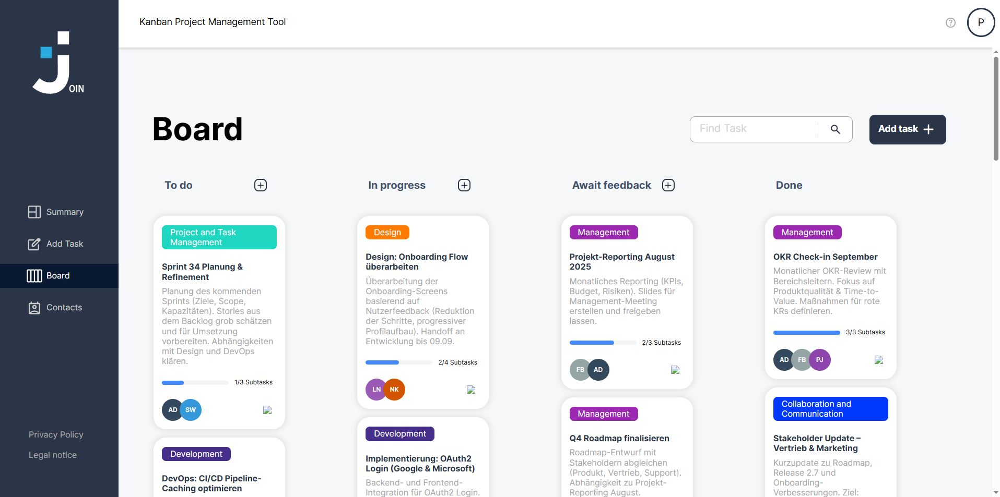
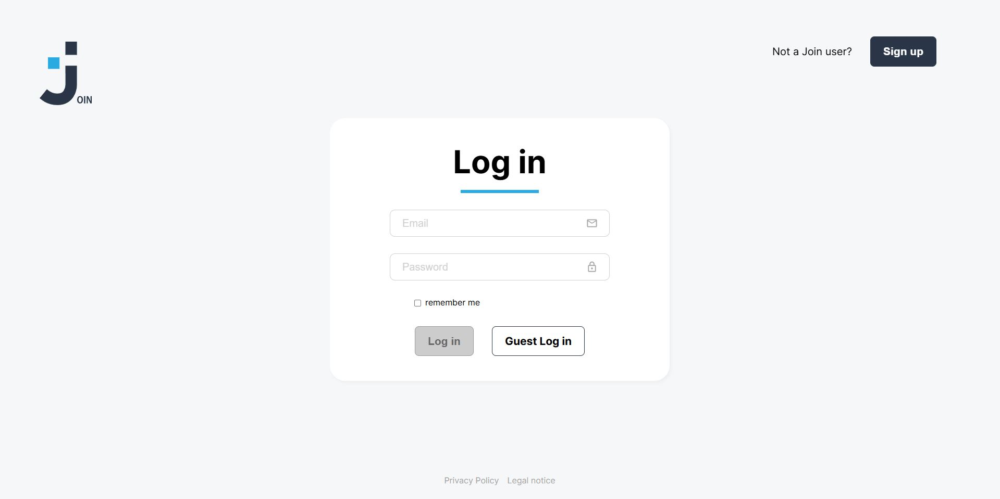
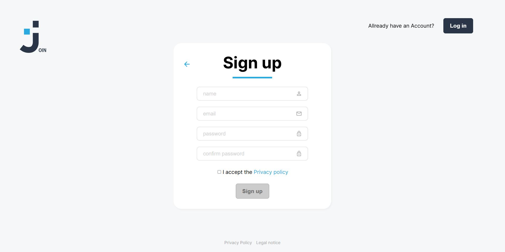
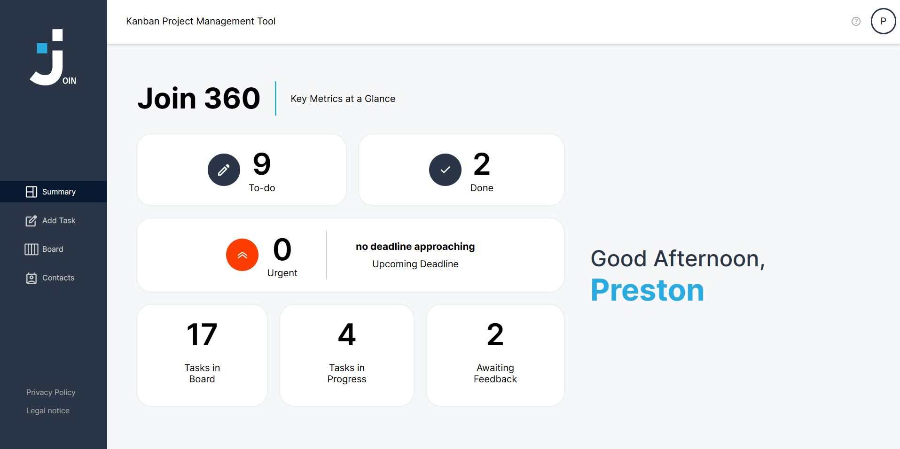

# 📌 Join – Kanban Board App

**Join** is a modern **Multi-Page Application (MPA)** for task and contact management in a Kanban style.  
The app provides an intuitive interface to organize tasks efficiently, manage contacts, and support teamwork.



---

## 🚀 Features

- 🔑 **User Management**
  - Registration, login, logout & guest login
  - Dashboard with greeting & task overview

- 📋 **Kanban Board**
  - Columns: ToDo, In Progress, Awaiting Feedback, Done
  - Create, edit, delete & move tasks via drag & drop
  - Subtasks with progress tracking
  - Real-time task search

- 👥 **Contacts**
  - Alphabetically sorted contact list with detail view
  - Add, edit, and delete contacts
  - Manage and update your own profile data

- ⚙️ **Additional Features**
  - Responsive design (desktop & mobile)
  - Integrated Legal Notice & Privacy Policy
  - User feedback on interactions (hover effects, toast messages, etc.)

---

## 🛠️ Technologies

- **HTML, CSS, JavaScript (ES6+)**
- Multi-Page Application architecture (MPA)
- Structured file organization
- JSDoc for code documentation

---






---

## ▶️ Installation & Local Setup

There are two ways to run the app locally:

### 🔽 Option 1: Download
1. Click **Code → Download ZIP** at the top of the repository.  
2. Extract the ZIP file on your computer.  
3. Open the folder in your editor (e.g., VS Code).  
4. Launch the app by opening **index.html** in your browser (right-click → *Open in Browser* or via *Live Server*).

### 💻 Option 2: Git Clone
1. Clone the repository:
   ```bash
   git clone https://github.com/your-github-username/join-kanban-board.git

2. Navigate into the project folder:
cd join-kanban-board


3. Start a local web server (e.g., VS Code extension Live Server).


4. Open index.html in your browser.


---
