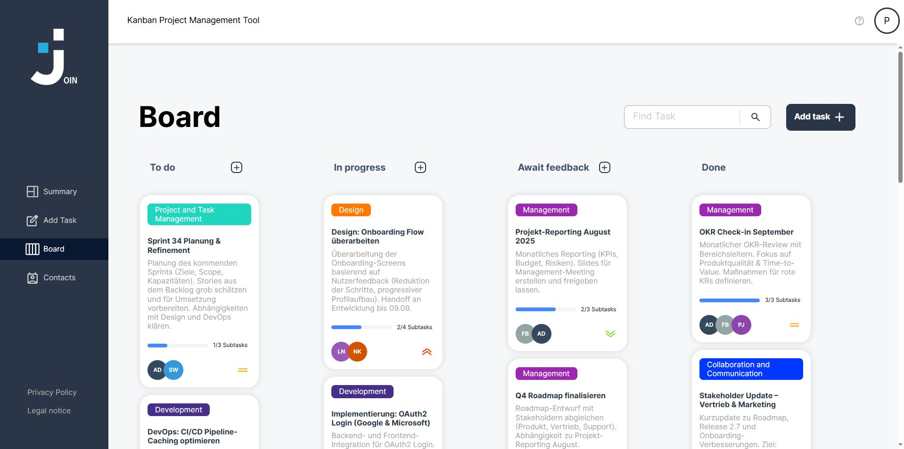

# 📌 Join – Kanban Board App

[](https://your-live-demo-url.com)
[](https://github.com/preston-jones/Join)

**Join** is a modern **Multi-Page Application (MPA)** for task and contact management in a Kanban style.  
Built with vanilla JavaScript, this collaborative project management tool provides an intuitive interface to organize tasks efficiently, manage contacts, and support seamless teamwork.

> **🎯 Try it out:** [Live Demo](https://your-live-demo-url.com)



---

## 🚀 Features

- 🔑 **User Management**
  - Registration, login, logout & guest login
  - Dashboard with greeting & task overview

- 📋 **Kanban Board**
  - Columns: ToDo, In Progress, Awaiting Feedback, Done
  - Create, edit, delete & move tasks via drag & drop
  - Subtasks with progress tracking
  - Real-time task search

- 👥 **Contacts**
  - Alphabetically sorted contact list with detail view
  - Add, edit, and delete contacts
  - Manage and update your own profile data

- ⚙️ **Additional Features**
  - Responsive design (desktop & mobile)
  - Integrated Legal Notice & Privacy Policy
  - User feedback on interactions (hover effects, toast messages, etc.)

---

## 🛠️ Tech Stack

| Frontend | Backend & Storage | Development |
|----------|------------------|-------------|
| HTML5, CSS3 | Firebase Realtime Database | VS Code |
| Vanilla JavaScript (ES6+) | RESTful API integration | Live Server |
| Responsive Design (Flexbox/Grid) | JSON data handling | Git version control |
| Multi-Page Application (MPA) | Session/Local Storage | JSDoc documentation |

### 📱 Browser Compatibility
- ✅ Chrome 90+
- ✅ Firefox 88+
- ✅ Safari 14+
- ✅ Edge 90+
- ✅ Mobile browsers (iOS Safari, Chrome Mobile)

---


---

## ▶️ Installation & Local Setup

There are two ways to run the app locally:

### 🔽 Option 1: Download
1. Click **Code → Download ZIP** at the top of the repository.  
2. Extract the ZIP file on your computer.  
3. Open the folder in your editor (e.g., VS Code).  
4. Launch the app by opening **index.html** in your browser (right-click → *Open in Browser* or via *Live Server*).

### 💻 Option 2: Git Clone
1. Clone the repository:
   ```bash
   git clone https://github.com/preston-jones/Join.git
   ```

2. Navigate into the project folder:
   ```bash
   cd Join
   ```

3. Start a local web server (e.g., VS Code extension Live Server).

4. Open `index.html` in your browser.

---
⭐ **Enjoyed this project?** Give it a star and share it with others!
